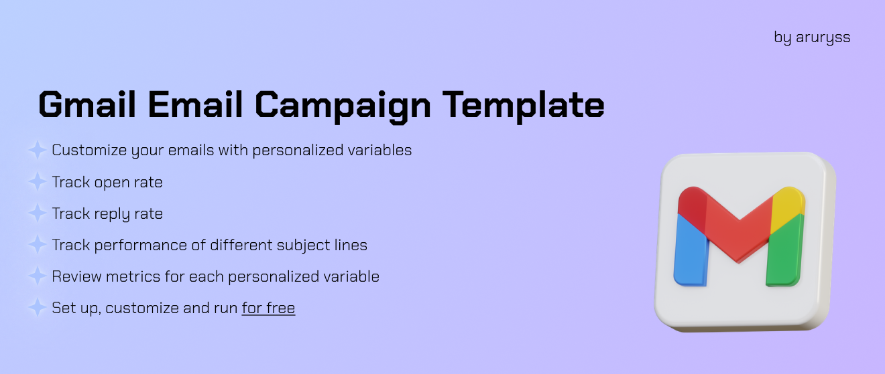

# Personalized Email Outreach Campaign Template




[](https://github.com/ellerbrock/open-source-badges/)

Badge [source](https://shields.io/)

## Overview

This repository features a comprehensive cold email outreach tracker built in Google Sheets using Google Apps Script, designed to streamline your email marketing efforts. It integrates essential functions similar to those found in LemList and HubSpot, including reply rate tracking, open rate tracking, and subject line testing.

The tracker allows users to manage and analyze their outreach campaigns effectively. With built-in formulas and functions, you can easily monitor engagement metrics and optimize your email strategies for better results.

Additionally, the project includes a visually appealing dashboard design that presents your data in an intuitive and accessible format. This makes it easy to understand your outreach performance at a glance.

The repository is open-source, inviting users to customize and expand upon the existing features. A detailed README is provided to guide you through setup and implementation, ensuring you can make the most of this resource. Your contributions and feedback are highly encouraged as we aim to enhance the tool for everyone in the community!

## Authors

- [@aruryss](https://www.github.com/aruryss)

## Features

- **Reply Rate Tracking**: Monitor the percentage of responses to your outreach emails.
- **Open Rate Tracking**: Track how many recipients open your emails.
- **Subject Line Testing**: Experiment with different subject lines to find the most effective ones.
- **Dashboard Design**: Visualize key metrics with an intuitive and attractive dashboard.
- **Customizable and Open Source**: Easily adapt the tracker to fit your needs and contribute to the project.

## Tech Stack

- Google Apps Script
- Google Sheets

## Quick Start

This guide will walk you through setting up the Email Campaign project from start to finish. Follow these steps to clone the repository, set up your environment, and start launching your own email outreach campaigns.

1. Make a copy of Google Sheet
2. Create Apps Script project and give permissions to run
3. Copy the code provided
4. Customize and write your own email code with personalization variables
5. Edit code according to your variables
6. Save the project, update the page and run through the function

#### Step 0: Pre-Requisites

Before starting, ensure you have the following:
- **Google account**: Needed for running the project and sending emails.

#### Step 1: Make coopy of Google Sheet

Open the <a href = "https://docs.google.com/spreadsheets/d/11-0akNC1ylaxBj1LtfIOvhbPIMTbB7Jg5247fTu9oEU/edit?usp=sharing">Google Sheet Template</a>. In the menu, click **File** and then **Make a copy**

#### Step 2: Create Apps Script project and give permissions to run

In the menu, click **Extensions** and then **Apps Script**. Rename the project from "Untitled" to your preferred name. You need to give permissions from your Googel Account for the code to run. To run a function from the script editor, at the top, select the name of the function you want to execute and click Run. Then you will be prompted to give permission from your Google Account to run the project.

_Note: The Google Account that you use to run the script from and saved Google Sheets on, is the one used for sending emails._

#### Step 3: Copy the code provided

Create .gs files with following names:

- Code.gs
- replytracking.gs

and copy the code from the respective files in this repo. Do the same for bodyOfEmail.html and bodyOfFollowUpEmail.html

#### Step 4: Customize and write your own email code with personalization variables

Edit the code in .html emails to your custom email body. <a href = "https://unlayer.com/templates">Unlayer</a> has some great templates to use. Leave the following code fragment in the html body:

```
" width="0" height="0">
```
We will change the ```img src``` after making all the changes to the script. It is tracking pixel that allows us to track open rate.

#### Step 5: Edit code according to your variables

Each personalization variable is indicated in the html code as such: ``` <?= VARIABLE_NAME ?> ``` and you should insert them in your html text as you wish. In the .gs files they are passed on to the html body as such: ``` template.VARIABLE_NAME = VARIABLE_NAME_IN_GS ```. Also add/delete those accordingly after collecting the data: ``` var VARIABLE_NAME_IN_GS = data[i][column_number - 1];```
When adding variables, right click the last variable column and add column to the right, so that all the formulas and other cofigurations stay intact.

To change sender name, edit the following line: ``` var sender_name = 'YOUR NAME' ```. Do the same for sheet name that we use to extract data from: ```var sheet = SpreadsheetApp.getActiveSpreadsheet().getSheetByName("email campaign template")```. There are also comprehensive comments in the code files to guide you and provide mroe details on how the code works and pulls data.

#### Step 6: Save the project, update the page and run through the function

After you have made all the changes it is time to set up tracking pixel and run the campaign! Save the project and press Deploy -> New Deployment in the upper right corner. Choose to deploy as a Web App. Set: Execute as to **Me**, and Who has access to **Anyone**. Press deploy and copy URL provided. Paste the URL (it must end with /exec) into the html code of the emails:
```
" width="0" height="0">
```

Save the project and refresh the Google Sheet File of yours. Now you are readu to run the campaign using Menu: Custom Functions ->
- Send First Email
- Sort Opened Emails
- Send Follow-up Email

  

#### Step 6: Testing and Validation

To verify your setup:
- Enter your own email into the table as an example
- Follow the steps and set up tracking
- Run the ```Send First Email``` function
- Open the email you received and confirm the correctness of the code
    
#### Step 7: Improvements and Feedback

I am always open to feedback and welcome the improvements you make to your own campaigns based on this template. If you have any suggestions feel free to contact me using <a href= "mailto:aru.ryssayeva@gmail.com">my email</a>.

## Repository structure

```

├── email-banner.png                              <- banner image used in the README.
│
│
├── bodyOfFollowUpEmail.html                      <- follow-up email body html file
│
│
├── bodyOfEmail.html                              <- first email body html file
│
│
├── replytracking.gs                              <- reply rate tracking code file
│
│
├── Code.gs                                       <- main code file
│
│
├── LICENSE                                       <- license file.
│
│
├── README.md                                     <- this readme file.


```

## Contributing

Contributions are welcome! For major changes, please open an issue first to discuss what you would like to change. Please ensure to update tests as appropriate.

## License

MIT License

Copyright (c) 2024 Stern Semasuka

Permission is hereby granted, free of charge, to any person obtaining a copy
of this software and associated documentation files (the "Software"), to deal
in the Software without restriction, including without limitation the rights
to use, copy, modify, merge, publish, distribute, sublicense, and/or sell
copies of the Software, and to permit persons to whom the Software is
furnished to do so, subject to the following conditions:

The above copyright notice and this permission notice shall be included in all
copies or substantial portions of the Software.

THE SOFTWARE IS PROVIDED "AS IS", WITHOUT WARRANTY OF ANY KIND, EXPRESS OR
IMPLIED, INCLUDING BUT NOT LIMITED TO THE WARRANTIES OF MERCHANTABILITY,
FITNESS FOR A PARTICULAR PURPOSE AND NONINFRINGEMENT. IN NO EVENT SHALL THE
AUTHORS OR COPYRIGHT HOLDERS BE LIABLE FOR ANY CLAIM, DAMAGES OR OTHER
LIABILITY, WHETHER IN AN ACTION OF CONTRACT, TORT OR OTHERWISE, ARISING FROM,
OUT OF OR IN CONNECTION WITH THE SOFTWARE OR THE USE OR OTHER DEALINGS IN THE
SOFTWARE.

Learn more about [MIT](https://choosealicense.com/licenses/mit/) license
